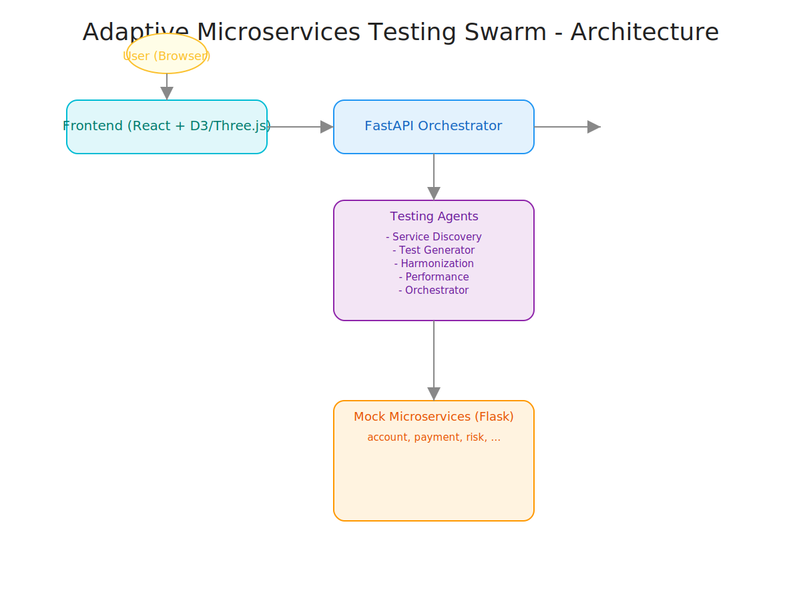

# Adaptive Microservices Testing Swarm - Technical Overview

## Architecture Diagram

## Components

### 1. Frontend (React + D3/Three.js)
- Interactive dashboard for visualizing the service mesh, risk, performance, and harmonization.
- Communicates with backend via REST API and WebSocket for real-time updates.

### 2. FastAPI Orchestrator (main.py)
- Central API gateway and coordinator.
- Exposes REST endpoints for service discovery, test generation, harmonization, metrics, and orchestrates the testing swarm.
- Hosts a persistent WebSocket endpoint for live metrics.

### 3. Testing Agents
- **Service Discovery Agent:** Scans and maps available microservices and their dependencies.
- **Test Generator Agent:** Creates intelligent test cases for each service.
- **Harmonization Agent:** Validates and transforms data formats between CS and UBS systems.
- **Performance Agent:** Monitors and analyzes service performance.
- **Orchestrator Agent:** Coordinates the above agents for end-to-end test execution.

### 4. Mock Microservices (Flask)
- 12 independent Flask apps simulating core banking microservices (account, payment, risk, etc.).
- Each runs on a separate port and exposes REST endpoints for testing.

## Data Flow
1. **User** interacts with the **Frontend** via browser.
2. **Frontend** sends REST/WebSocket requests to the **FastAPI Orchestrator**.
3. **Orchestrator** delegates tasks to the appropriate **Testing Agents**.
4. **Agents** interact with **Mock Microservices** to run tests, collect data, and harmonize formats.
5. **Results** and **metrics** are streamed back to the **Frontend** for visualization.

---
For more details, see the main README or contact the Cognizant demo team. 